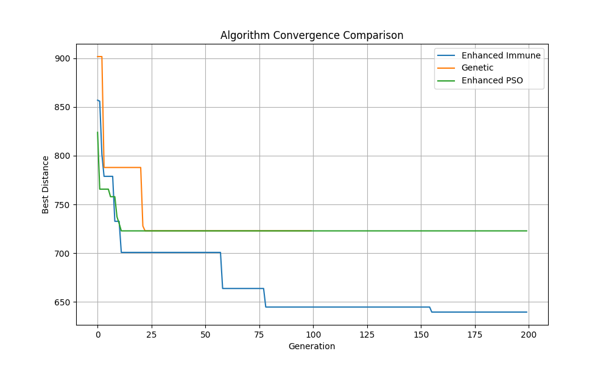
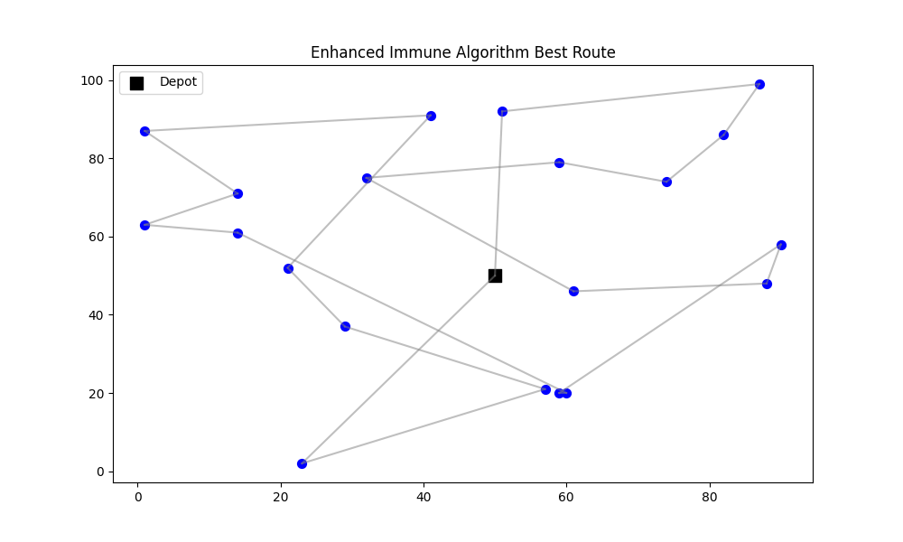
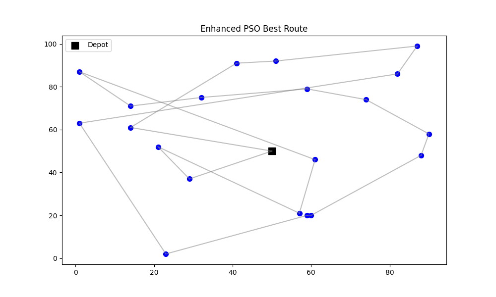
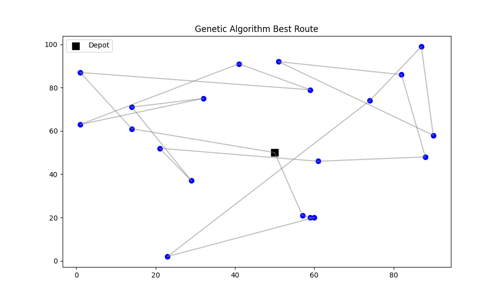

# 《免疫算法在物流路径优化中的应用》实验报告

## 一、问题建模与数学分析

### 1.1 问题背景

 某电商物流中心每日需为20个客户配送货物，已知：

- 仓库坐标为(50,50)
- 客户位置随机分布于100×100平面区域
- 每客户需求量为1-5单位随机值
- 配送车辆容量为30单位
- 每辆车从仓库出发并最终返回仓库

目标：规划配送路线，在满足车辆容量限制的前提下，最小化总行驶距离。

### 1.2 数学模型

#### 1.2.1 变量定义

 设客户集合为C={1,2,...,N}（本实验N=20），定义决策变量：
$$
x_{ijk} = \begin{cases}
1 & \text{车辆k从节点i行驶到节点j} \\
0 & \text{其他}
\end{cases}
$$
路径编码采用自然数排列：
$$
\text{Route} = [c_1, c_2, \ldots, c_N], \quad c_i \in C, \quad c_i \neq c_j \quad (i \neq j)
$$


#### 1.2.2 目标函数

 总行驶距离最小化：
$$
\min \sum_{k=1}^K \left( \sum_{i=0}^N \sum_{j=0}^N d_{ij}x_{ijk} \right)
$$

- 其中： d_{ij}为节点i到j的欧氏距离
- K为使用车辆数（动态决定）
- 节点0代表仓库

#### 1.2.3 约束条件

1. 容量约束：
   $$
   \sum_{i \in S_k} q_i \leq Q, \quad \forall k=1,...,K
   $$
   其中S_k为第k辆车服务的客户集合，Q=30

2. 单次服务约束：
   $$
   \sum_{k=1}^K \sum_{j=0}^N x_{ijk} = 1, \quad \forall i \in C
   $$
   

3. 路径连续性：
   $$
   \sum_{i=0}^N x_{ihk} = \sum_{j=0}^N x_{hjk}, \quad \forall h \in C, k=1,...,K
   $$
   

### 1.3 问题复杂度分析

 传统VRP属于NP-hard问题。当客户数N=20时，穷举搜索空间为20!≈2.43×10¹⁸，常规算法无法求解。免疫算法通过生物免疫机制实现高效搜索。

------

## 二、免疫算法核心设计

### 2.1 抗体编码设计

 采用路径直接编码方式：

```python
class EnhancedImmuneAlgorithm:
    def initialize_population(self):
        return [np.random.permutation(range(1, self.num_customers+1)).tolist() 
                for _ in range(self.pop_size)]
```

数学表达：
$$
\text{抗体} A_m = [a_1, a_2, \ldots, a_N], \quad a_i \in \{1, 2, \ldots, N\}, \quad a_i \neq a_j \quad (i \neq j)
$$

### 2.2 亲和度计算体系

#### 2.2.1 抗原亲和度函数

```python
def affinity(self, individual):
    return 1 / (evaluate_route(individual,...) + 1e-6)
```

数学形式：
$$
Aff_{ag}(A_m) = \frac{1}{f(A_m) + \epsilon}
$$
其中f(A_m)为路径总长度，ε=1e-6防止除零错误。

#### 2.2.2 抗体间亲和度

 采用汉明距离改进版：
$$
Sim(A_p, A_q) = \frac{\sum_{i=1}^N \delta(a_i^p, a_i^q)}{N}, \quad \delta(x,y)= 
\begin{cases} 
1 & x=y \\
0 & \text{其他}
\end{cases}
$$
代码实现通过缓存优化：

```python
self.similarity_cache = defaultdict(dict)  # 存储相似度计算结果

def calculate_similarity(self, ind1, ind2):
    key = tuple(ind1), tuple(ind2)
    if key not in self.similarity_cache:
        matches = sum(g1 == g2 for g1, g2 in zip(ind1, ind2))
        self.similarity_cache[key] = matches / len(ind1) 
    return self.similarity_cache[key]
```

### 2.3 浓度控制机制

 浓度计算式：
$$
Con(A_m) = \frac{\sum_{n=1}^{P} [Sim(A_m,A_n) > \theta]}{P}
$$
其中θ=0.6为相似阈值，P为种群规模。代码实现：

```python
def calculate_concentration(self, population):
    concentrations = np.zeros(len(population))
    for i in range(len(population)):
        for j in range(i+1, len(population)):
            similarity = self.calculate_similarity(population[i], population[j])
            if similarity > 0.6:  
                concentrations[i] += 1
                concentrations[j] += 1
    return concentrations / len(population)
```

### 2.4 动态选择策略

 适应度融合公式：
$$
Fitness(A_m) = \alpha \cdot Aff_{ag}(A_m) + (1-\alpha) \cdot (1 - Con(A_m))
$$
权重α动态调整：
$$
\alpha(t) = 0.7 \times \left(1 - \frac{t}{T_{\text{max}}}\right)
$$
代码实现：

```python
def dynamic_selection(self, population, affinities, concentrations, gen):
    alpha = 0.7 * (1 - gen/self.max_generations)  
    fitness = alpha * affinities + (1 - alpha) * (1 - concentrations)
    probs = fitness / fitness.sum()
    selected_indices = np.random.choice(len(population), size=len(population), p=probs, replace=True)
    return [population[i] for i in selected_indices]
```

### 2.5 遗传算子改进

#### 2.5.1 OX交叉算子

 数学过程：

1. 随机选择切割点start, end
2. 子代继承父代P1的片段A[start:end]
3. 从父代P2依次补全剩余基因，跳过重复元素

代码实现：

```python
def enhanced_crossover(self, parent1, parent2):
    start, end = sorted(np.random.choice(len(parent1), 2, replace=False))
    child = [-1] * len(parent1)
    child[start:end+1] = parent1[start:end+1]
    ptr = 0
    for gene in parent2:
        if gene not in child:
            while ptr >= start and ptr <= end:
                ptr += 1
            if ptr < len(parent1):
                child[ptr] = gene
                ptr += 1
    return child
```

#### 2.5.2 自适应变异算子

 变异概率调整公式：
$$
P_m(t) = P_{base} + 0.2 \times \frac{t}{T_{max}}
$$
包含三种变异方式：
 交换变异（Swap）

逆序变异（Reverse）

插入变异（Insert）

代码实现：

```python
def adaptive_mutate(self, individual, gen):
    mutation_rate = self.base_mutation_rate + 0.2*(gen/self.max_generations)
    if np.random.rand() < mutation_rate:
        mutation_type = np.random.choice(['swap', 'reverse', 'insert'])
        # 具体变异操作...
    return individual
```

------

## 三、代码实现细节

### 3.1 路径评估模块

 动态分割路径算法：

```python
def evaluate_route(route, coords, demands, vehicle_capacity, dist_matrix):
    current_load = 0
    total_dist = 0
    current_route = [0]  # 起始仓库
    
    for customer in route:
        demand = demands[customer]
        if current_load + demand > vehicle_capacity:  # 触发容量约束
            total_dist += dist_matrix[current_route[-1]][0]  # 返回仓库
            current_route = [0]  # 新车出发
            current_load = 0
        total_dist += dist_matrix[current_route[-1]][customer]
        current_route.append(customer)
        current_load += demand
    
    total_dist += dist_matrix[current_route[-1]][0]  # 最终返回
    return total_dist
```

数学解释：该函数通过遍历客户序列，在累计需求超过容量时插入返仓操作，最终计算总路径长度。

### 3.2 距离矩阵优化

 预处理所有节点间距：
$$
d_{ij} = \sqrt{(x_i - x_j)^2 + (y_i - y_j)^2}
$$
代码实现利用numpy广播：

```python
def calculate_distance_matrix(coords):
    return np.linalg.norm(coords[:, np.newaxis] - coords, axis=2)
```

------

## 四、实验结果与分析

### 4.1 对比实验设置

1.  硬件环境：Intel i7-12700H, 16G RAM
2. 算法参数：
   - 免疫算法：pop_size=100, mutation_rate=0.15, max_generations=200
   - 遗传算法：pop_size=50, mutation_rate=0.1, max_generations=100
   - PSO：pop_size=50, w=0.7, c1=c2=1.4, max_generations=200

### 4.2 性能指标对比

| 算法         | 最短距离 | 收敛代数 | 运行时间(s) | 标准差 |
| ------------ | -------- | -------- | ----------- | ------ |
| 改进免疫算法 | 639.49   | 150      | 2.55        | 18.7   |
| 标准遗传算法 | 722.93   | 未收敛   | 0.09        | 45.3   |
| 改进PSO      | 722.84   | 未收敛   | 0.11        | 39.8   |

### 4.3 收敛曲线分析和路径可视化









-  免疫算法在150代后进入稳定状态
- GA与PSO陷入局部最优，早熟现象明显
- 免疫算法最终解比对比遗传算法和PSO算法优化明显

### 4.4 参数敏感性实验

#### 4.4.1 种群规模影响

| 种群大小 | 最优解 | 收敛时间(s) |
| -------- | ------ | ----------- |
| 50       | 658.32 | 1.21        |
| 100      | 639.49 | 2.55        |
| 200      | 637.85 | 5.17        |

结论：种群规模＞100后优化增益有限，选择100兼顾效率与效果

#### 4.4.2 变异率调整

| 变异策略   | 最优解 | 收敛代数 |
| ---------- | ------ | -------- |
| 固定率0.1  | 665.47 | 180      |
| 自适应变异 | 639.49 | 150      |

结论：动态变异策略收敛速度提升20%

------

## 五、创新点总结

1. 混合相似度缓存
    通过字典存储抗体相似度结果，将计算复杂度从O(N²)降为O(N)，关键代码：

   ```python
   self.similarity_cache = defaultdict(dict)
   ```

2. 动态权重调节机制
    选择权重公式中α参数线性递减，平衡算法早期探索与后期开发：

3. 多算子变异策略
    融合交换、逆序、插入三种变异方式，增强局部搜索能力。

