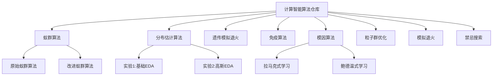

# 计算智能算法仓库

这个仓库用于存储我在Huizhou university学习期间的“计算智能”这门课程的作业。仓库包含了多种计算智能算法的实现，主要用于解决优化问题，特别是物流路径规划等NP-hard问题。

## 项目结构

## 算法实现概述

### 免疫算法

针对物流路径优化问题的免疫算法实现，具有以下特点：

- **动态选择策略**：适应度计算融合亲和度与浓度信息，权重动态调整
- **亲和度计算体系**：使用改进的汉明距离计算抗体相似度
- **浓度控制机制**：维持种群多样性，避免早熟收敛
- **创新优化**：
  - 混合相似度缓存：将计算复杂度从O(N²)降为O(N)
  - 动态权重调节：平衡探索与开发能力
  - 多算子变异策略：融合交换、逆序、插入三种变异方式

实验结果表明，免疫算法与标准遗传算法和改进PSO相比，在最短距离、收敛速度和解决方案稳定性方面均有明显优势。

### 模因算法

用于TSP问题求解的Memetic ACO实现，结合：

- 蚁群算法的全局搜索能力
- 局部搜索算法(2-opt)的精细调优能力
- 可视化生成功能，展示算法收敛过程

### 其他算法

- **蚁群算法**：包含原始版本和改进版本
- **分布估计算法**：
  - 实验1：基础EDA实现
  - 实验2：基于高斯分布的注塑成型工艺参数优化
- **遗传模拟退火**：结合遗传算法与模拟退火的混合实现
- **禁忌搜索**：通过禁忌列表避免循环搜索
- **模拟退火**：针对组合优化问题的经典实现

## 使用方法

各算法目录下包含独立的Python实现和对应说明文档。

## 免责声明

本仓库仅用于计算智能相关作业保留，允许用于交流学习和参考，但请注意不要用于任何形式的作业抄袭！
