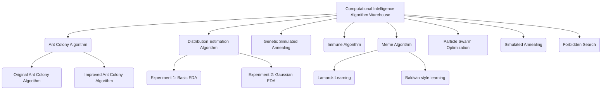

# Computational Intelligence Algorithm Warehouse
This warehouse is used to store my assignments for the course "Computational Intelligence" during my studies at Huizhou University. The warehouse contains the implementation of various computational intelligence algorithms, mainly used to solve optimization problems, especially NP-hard problems such as logistics path planning.
## Project Structure

## Overview of Algorithm Implementation
### Immune Algorithm
The implementation of the immune algorithm for logistics path optimization has the following characteristics:
- **Dynamic selection strategy**: Fitness calculation integrates affinity and concentration information, and weights are dynamically adjusted.
- **Affinity Calculation System**: Using Improved Hamming Distance to Calculate Antibody Similarity.
- **Concentration control mechanism**: Maintain population diversity and avoid premature convergence.
- **Innovation and Optimization**:
  - **Hybrid similarity caching**: Reducing computational complexity from O(N²) to O(N).
  - **Dynamic weight adjustment**: Balancing exploration and development capabilities.
  - **Multi-operator mutation strategy**: Fusion exchange, reverse order, and insertion of three mutation methods.
  The experimental results show that compared with the standard genetic algorithm and improved PSO, the immune algorithm has significant advantages in shortest distance, convergence speed, and solution stability.
### Meme Algorithm
Memetic ACO implementation for TSP problem-solving, combined with:
- The global search capability of ant colony algorithm.
- Fine-tuning capability of local search algorithm (2-opt).
- Visual generation function, showcasing the convergence process of algorithms.
### Other Algorithms
- **Ant Colony Algorithm**: Includes both original and improved versions.
- **Distribution Estimation Algorithm**:
  - Experiment 1: Basic EDA Implementation.
  - Experiment 2: Optimization of Injection Molding Process Parameters Based on Gaussian Distribution.
- **Genetic Simulated Annealing**: Hybrid Implementation of Genetic Algorithm and Simulated Annealing.
- **Taboo Search**: Avoid circular search through taboo lists.
- **Simulated Annealing**: A Classic Implementation for Composite Optimization Problems.
## Usage Method
Each algorithm directory contains independent Python implementations and corresponding documentation.
## Disclaimers
This warehouse is only used for the retention of intelligent related homework and is allowed for communication, learning, and reference. However, please be careful not to use it for any form of homework plagiarism!
